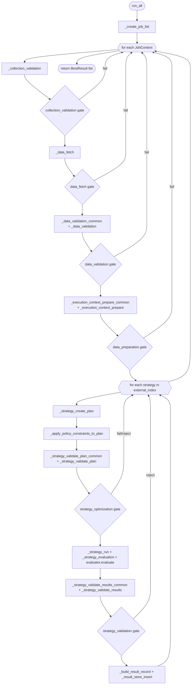

# Development Notes

This document captures implementation details that are useful when maintaining
the backtest engine.

## Backtest Runner Overview

Source: `BacktestRunner.run_all` in `src/backtest/runner.py`.

### High-level flow

1. Build executable jobs from collections/symbols/timeframes.
2. For each job, run gate stages in order:
   - collection validation
   - data fetch
   - data validation
   - execution-context preparation
3. For each discovered strategy:
   - create strategy plan (fixed params + search space)
   - apply job-level optimization constraints
   - validate strategy plan
   - run strategy evaluation (baseline/grid/optuna path)
   - validate strategy outcome
4. Assemble `BestResult`, persist stores/caches, and return run results.

### Gate model

- Each stage returns a `GateDecision` with:
  - `passed`
  - `action` (`continue`, `skip_optimization`, `baseline_only`, `skip_job`, `skip_collection`, `reject_result`)
  - `reasons`
- Stage decisions are composed by `_compose_gate_decisions`.
- `skip_optimization` is a job-level signal; strategy execution falls back to
  baseline-only evaluation.

### Evaluation model

- Runner orchestration owns job/strategy loops and gating.
- Evaluator owns simulation + metric computation.
- Cache/store writes happen after evaluation results are enriched.

### Flow diagram (Mermaid)

## Continuity Score Calendar Behavior

Source: `BacktestRunner.compute_continuity_score` in
`src/backtest/runner.py`.

### Timeframe shape terms

- `daily`: timeframe unit is `d/day/days`.
- `eod-like`: broader end-of-day family (`daily`, `weekly`, `monthly`).

### Calendar decision flow

1. `calendar_kind=exchange` + daily + exchange code set:
   - Uses `exchange_calendars` sessions for expected dates.
2. `calendar_kind in {weekday, exchange}` + daily:
   - Uses weekday expected dates (Mon-Fri).
3. All other cases (including weekly/monthly):
   - Uses fixed-delta gap counting from actual timestamps.

### Missing-gap implementation

- Missing bars against an expected index are computed via boolean membership.
- Largest consecutive missing gap is computed with vectorized NumPy transition
  detection.

### Related tests

- `tests/test_backtest_runner.py::test_compute_continuity_score_weekend_gap_not_missing_for_weekday_calendar`
- `tests/test_backtest_runner.py::test_compute_continuity_score_exchange_calendar_ignores_market_holiday`
- `tests/test_backtest_runner.py::test_compute_continuity_score_weekday_calendar_non_daily_uses_fixed_delta`

## Validation Policy Resolution

Source: `resolve_validation_overrides` in `src/config.py`.

- Resolution ownership is in config loading, not in runner runtime.
- Effective policy is materialized on each collection under `collection.validation`.
- Runner then only reads collection-level effective policies.

### Resolution rules (per module)

- Modules: `validation.data_quality`, `validation.optimization`, `validation.result_consistency`.
- If neither global nor collection policy is set: module stays disabled (`None`).
- If only global is set: collection inherits global policy.
- If only collection is set: collection policy is normalized and used.
- If both are set: collection override takes precedence.
- The persisted validation profile stores only effective collection-level policies
  (`profile.collections`), not top-level global input blocks.

### Why this matters

- Runner code stays lean: no global-vs-collection merge branches in gate execution.
- Hashing/job profiles use effective collection policy consistently.
- Behavior is deterministic across tests and real runs after `load_config`.

## Config Parse-To-Effective Pattern

Source: `load_config`, parser helpers, and merge helpers in `src/config.py`.

This is the implementation contract for validation/policy config work.

### Naming and phase contract

Use this lifecycle for each policy module:

1. `_parse_*`
   - Input: raw YAML value (`Any`).
   - Output: typed dataclass or `None`.
   - Job:
     - enforce mapping shape (`require_mapping`)
     - parse primitive fields (`parse_required_*`, `parse_optional_*`)
     - validate required keys for that module
   - Rule: do not apply inheritance-sensitive defaults here.

2. `_normalize_*`
   - Input: typed dataclass (possibly from parser or merge result).
   - Output: validated, normalized dataclass.
   - Job:
     - value range checks
     - string normalization
     - nested block normalization
   - Optional parameter: default value injection (only for effective-policy stage).
   - Note: normalization is used both pre-merge (parser output hygiene) and post-merge
     (final effective-policy normalization/defaulting).

3. `_merge_*_config`
   - Input: `base` (global), `override` (collection).
   - Output: effective module config or `None`.
   - Job:
     - resolve fields via `_merged_field` (override wins only when non-`None`)
     - enforce required merged fields
     - call `_normalize_*` for final validation/defaults
   - Rule: merge is the canonical place for effective defaults.

4. `resolve_validation_overrides`
   - Build normalized global runtime policy snapshots.
   - Merge each collection override onto global.
   - Write final effective policy to `collection.validation`.

5. Runner consumption
   - Runner reads effective collection policy only.
   - Runner does not perform global/collection merge logic.

### Defaulting rules (strict)

- Parse-stage defaults:
  - allowed for top-level runtime config (non-override policy), e.g. `metric`, `engine`, `fees`.
  - avoid for override-sensitive policy fields.

- Merge-stage defaults:
  - preferred for policy fields that participate in global+collection inheritance.
  - example: `stationarity.min_points`
    - parse: may remain `None`
    - merge effective config: default to `30` when still `None`
    - collection `null`/omission inherits global value if global is set.

### Practical implementation template for new policy module

When adding a new module under `validation.*`:

1. Add dataclass fields (global + collection paths).
2. Add `_parse_new_module(...)` with strict shape/key/range validation.
3. Add `_normalize_new_module(...)` for final normalization rules.
4. Add `_merge_new_module_config(base, override)` and call normalize there.
5. Wire module into:
   - `_parse_validation_*` tree
   - `_merge_data_quality_config` / relevant parent merge
   - `resolve_validation_overrides`
6. Update runner to read only `collection.validation...` effective values.
7. Add tests for:
   - parse happy path
   - missing required keys
   - range/type errors
   - global-only, collection-only, global+override merge behavior
   - explicit `None` inheritance behavior

### Existing examples in codebase

- Outlier detection:
  - merge path reuses parse validation to keep strict behavior aligned.
- Stationarity:
  - final `min_points` default injected at merge normalization.
- Result consistency:
  - nested modules merged and enabled independently; module disabled when `None`.

### Responsibility split

- `config.py`: parse, normalize, merge, and materialize effective policies.
- `runner.py`: gate enforcement and diagnostics only.
