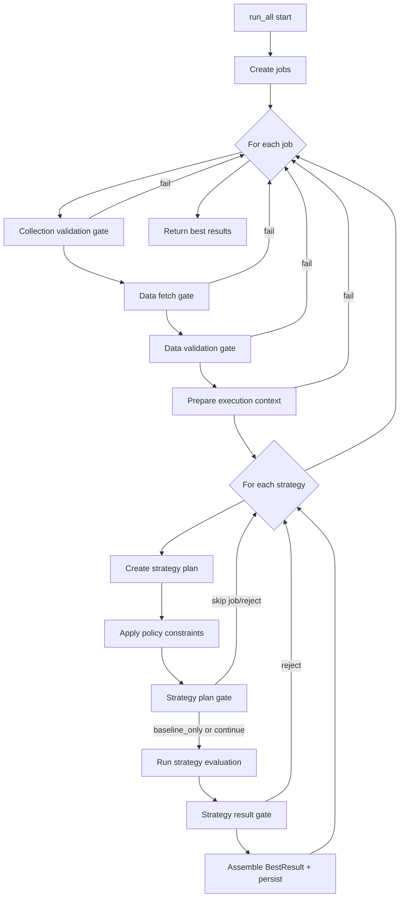

# Development Notes

This document captures implementation details that are useful when maintaining
the backtest engine.

## Backtest Runner Overview

Source: `BacktestRunner.run_all` in `src/backtest/runner.py`.

### High-level flow

1. Build executable jobs from collections/symbols/timeframes.
2. For each job, run gate stages in order:
   - collection validation
   - data fetch
   - data validation
   - execution-context preparation
3. For each discovered strategy:
   - create strategy plan (fixed params + search space)
   - apply job-level optimization constraints
   - validate strategy plan
   - run strategy evaluation (baseline/grid/optuna path)
   - validate strategy outcome
4. Assemble `BestResult`, persist stores/caches, and return run results.

### Gate model

- Each stage returns a `GateDecision` with:
  - `passed`
  - `action` (`continue`, `skip_optimization`, `baseline_only`, `skip_job`, `skip_collection`, `reject_result`)
  - `reasons`
- Stage decisions are composed by `_compose_gate_decisions`.
- `skip_optimization` is a job-level signal; strategy execution falls back to
  baseline-only evaluation.

### Evaluation model

- Runner orchestration owns job/strategy loops and gating.
- Evaluator owns simulation + metric computation.
- Cache/store writes happen after evaluation results are enriched.

### Flow diagram (Mermaid)

## Continuity Score Calendar Behavior

Source: `BacktestRunner.compute_continuity_score` in
`src/backtest/runner.py`.

### Timeframe shape terms

- `daily`: timeframe unit is `d/day/days`.
- `eod-like`: broader end-of-day family (`daily`, `weekly`, `monthly`).

### Calendar decision flow

1. `calendar_kind=exchange` + daily + exchange code set:
   - Uses `exchange_calendars` sessions for expected dates.
2. `calendar_kind in {weekday, exchange}` + daily:
   - Uses weekday expected dates (Mon-Fri).
3. All other cases (including weekly/monthly):
   - Uses fixed-delta gap counting from actual timestamps.

### Missing-gap implementation

- Missing bars against an expected index are computed via boolean membership.
- Largest consecutive missing gap is computed with vectorized NumPy transition
  detection.

### Related tests

- `tests/test_backtest_runner.py::test_compute_continuity_score_weekend_gap_not_missing_for_weekday_calendar`
- `tests/test_backtest_runner.py::test_compute_continuity_score_exchange_calendar_ignores_market_holiday`
- `tests/test_backtest_runner.py::test_compute_continuity_score_weekday_calendar_non_daily_uses_fixed_delta`
